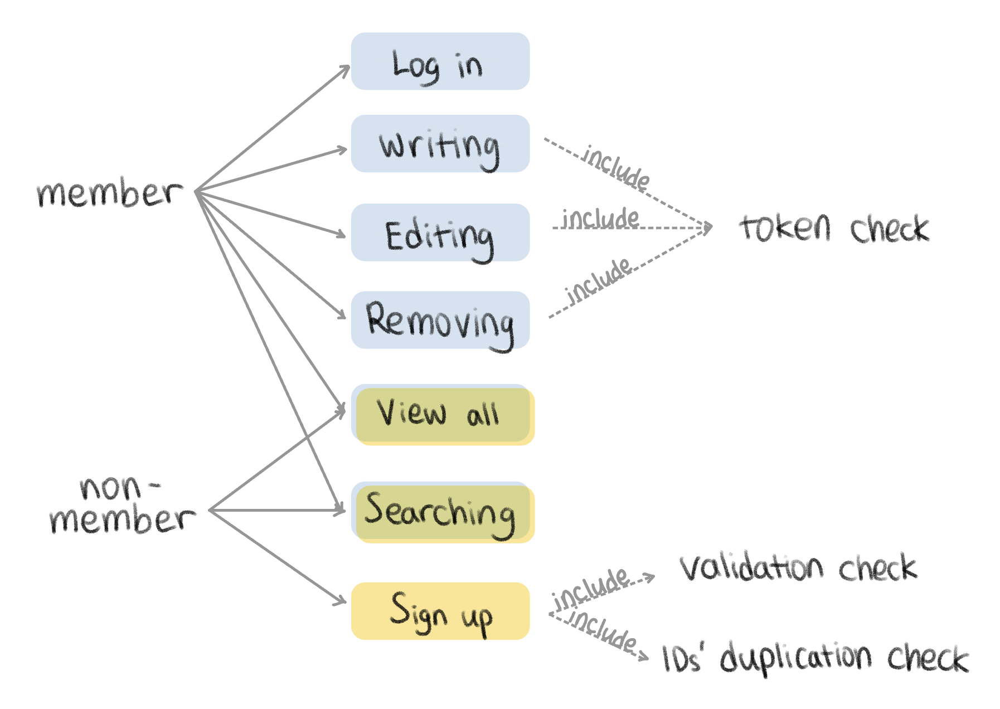

# Noticeboard using Springboot

### 1. Overview

---
### 2. Features
#### Sign up & log in
1. Sign up
    - Client will input username and password
    - Validation check for username and password
      - username constraints: Must be 4-10 characters(a-z 0-9)
      - passwrod constraints: Must be 8-15 characters(a-z A-Z 0-9) and include at least one symbol
    - Check duplication of username 
    - Store client data and send success message to client and return the status code
    - Assign authorization status(ADMIN or USER)
      - ADMIN can edit and remove all posts
2. Log in
    - Cleint can put their username and password
    - Check username and password in DB
    - If they are already stored in the DB, create token using user information and JWT and add it to the Header, then return success message and status code
---
#### Postings
1. View all postings
    - Retrieve title, username, contents, or date
    - Return postings with all coments to the client
    - Order by date and show postings and comments
    - Return with 'likes' of the posting and comments
    
2. Write a post
    - Check and authorize token using Spring Security
    - Save title, username, password, and content
    - Return saved posting to the client 

3. Retrieve posting
    - Retrieve title, username, date, contents of selected posting
    - Return selected postings with all coments to the client
    - Order comments by date
    - Return with 'likes' of the posting and comments

4. Edit posting
    - Check and authorize token using Spring Security
    - Return edited posting to client
    - Return with 'likes' of posting
5. Remove posting
    - Check and authorize token using Spring Security
    - Removed posting, then return success message and status code
---
#### Comments
1. Write comments
   - Write comments only if the token is authorized
   - Check the positing is in the DB, and if it is, write a comment
   - Return comment to the client
2. Edit comments
    - Edit comments if the token is authorized and username is matched after checking the token
    - Edit comments if the comment is in the DB
    - Return edited comments to the client
    - Return with 'likes' of the comments
3. Remove comments
    - Remove comments if the token is authorized and username is matched after checking the token
    - Remove comments if the comment is in the DB
    - Return success message and status code to the client
---
#### Likes
1. 'Likes' to the posting
   - Can 'Likes' to the posting
   - Double click 'likes' to cancel the 'likes'
   - Return success message and status code to the client
2. 'Likes' to the comments
   - Can 'Likes' to the comments
   - ouble click 'likes' to cancel the 'likes'
   - Return success message and status code to the client
---
#### Exeption handling
Return statusCode: 400 when:
 - username didn't meet the requirements -> 'Must be 4-10 characters(a-z 0-9)'
 - password didn't meet the requirements -> 'Must be 8-15 characters(a-z A-Z 0-9) and include at least one symbol'
 - username and password don't match while logging in -> 'Cannot find username'
 - token is not valid or token is not passed in the case it should be passed in the API requst -> 'Token is not valid'
 - user trys to edit/remove postings which is not written by the user -> 'Only user can edit/remove the post'
 - user request to sign up with username which is already in the DB -> 'Duplicated username'

 
<!-- ""
> ❓ Why : 질문과 답변

1. **수정, 삭제 API의 request를 어떤 방식으로 사용하셨나요? (param, query, body)**
   - **param**, **body** 방식을 사용하였다.
   - 수정, 삭제 모두 대상 게시글의 id를 받아야 하므로 서버에서 `@PathVariable`로 id를 받도록 **param** 방식을 사용하였다.
   - 수정할 때는 수정할 내용 { `title`, `contents`, `author`, `passwrod` } 를 받아야 하고, 삭제할 때는 { `password` } 를 받아야 하므로, 서버에서 `@RequestBody`로 데이터를 넘길 수 있도록 **body** 방식을 사용하였다.
2. **어떤 상황에 어떤 방식의 request를 써야하나요?**
   - **param**
      - 주소에서 포함된 변수를 받는다.
      - `/api/post/{id}`
      - `/api/post/id/{id}/name/{name}`
      - 식별할 데이터에 대한 정보를 받아올 때 적절하다.
         - `/books/123` → 123번 책 정보를 가져온다.
      - 서버에서 `@PathVariable` 로 받는다.
   - **query**
      - 엔드포인트에서 물음표(?) 뒤에 key=value 형태로 변수를 담는다.
      - `api/post?key=value&key2=value2`
      - 정렬이나 필터링이 필요한 경우 적절하다.
         - `/books?genre=novel` → 장르가 소설인 책 목록을 가져온다.
   - **body**
      - URL에는 보이지 않는 오브젝트 데이터(JSON, XML 등)를 담는다.
      - 객체를 바로 담아서 보낼 경우 적절하다.
3. **RESTful한 API를 설계했나요? 어떤 부분이 그런가요? 어떤 부분이 그렇지 않나요?**
   - `RESTful` : REST API 의 설계 의도를 명확하게 지킴으로써, 각 구성 요소들의 역할이 완벽하게 분리되어 있어, URI만 보더라도 리소스를 명확하게 인식할 수 있도록 표현한 설계 방식
      - 메서드 기능이나 뷰가 아닌, **리소스(데이터) 중심의 API를** 구성해야 한다.

        → 게시글이라는 `post` 리소스 중심으로 API를 설계하였다.

        → 메서드 기능은 http 메서드에서 미리 정의되어 있으므로, URI에는 대상이 되는 리소스(`post`)만 담도록 설계하였다.

4. **적절한 관심사 분리를 적용하였나요? (Controller, Repository, Service)**
   - `Controller` : URL 맵핑을 통해 특정 메서드가 호출되도록 한다.
      - http 메서드와 함께 특정 URL로 요청이 올 때, 특정 메서드가 실행되게 구현했다.
   - `Service` : 비지니스 로직을 수행한다.
      - 메서드의 기능을 직접 구현하며 repository에서 데이터를 가져오거나 저장한다.
   - `Repository` : 데이터베이스에 저장하고 조회하는 기능을 수행한다.
      - `JpaRepository` 를 상속받아 `Board` 엔티티를 DB에 저장하도록 구현했다.
5. **API 명세서 작성 가이드라인을 검색하여 직접 작성한 API 명세서와 비교해보세요!**
   - `기능`, `메서드`, `URL`, `Request`, `Response` 항목으로 작성했다. -->